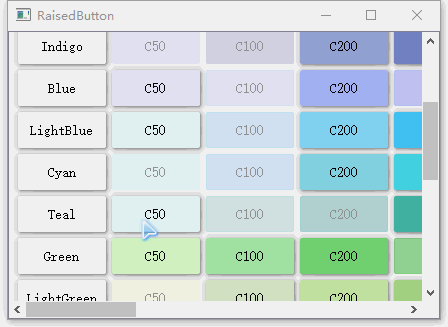
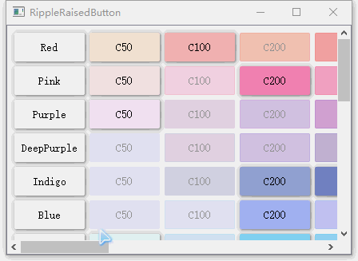
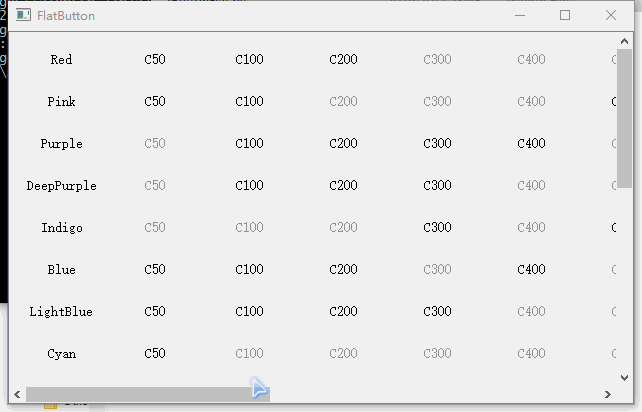
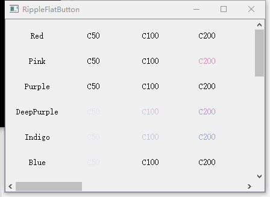
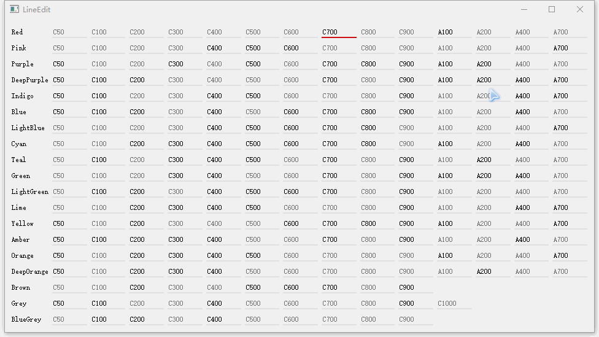

#QMaterial
 Material Design By PyQt(PyQt5 Material Design)
 Don't use QSS(不使用QSS方式)
 To be continued(持续更新)

###[Python3.4.4 or Python3.5][PyQt5]

#ScreenShot

##Raised Button

##Floading Button

##Flat Button

##LineEdit
